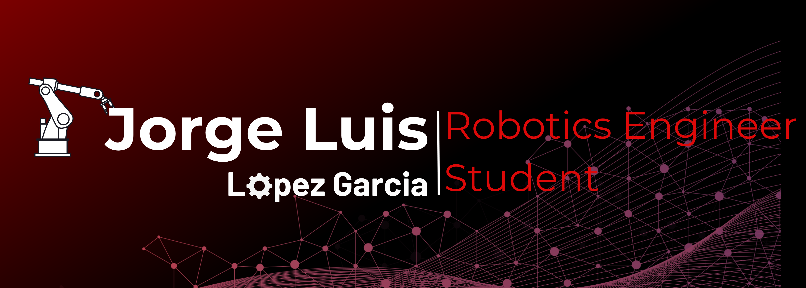

<!-- Banner -->

  

# Hi! My name is Jorge Lopez  
Robotics and Digital Systems Engineering Student | Autonomous Systems & Computer Vision  

---

## 👨‍💻 About Me
Hey! I’m Jorge, a dedicated Robotics and Digital Systems Engineering student.  
My main focus is on **autonomous vehicles**, **robotics**, and **computer vision**, and I’m passionate about applying AI to solve real-world challenges.  
I also enjoy working on **CAD design** and **3D printing**, exploring how digital fabrication can enhance robotics and automation projects.  

---

## 🚀 Currently
- Enrolled in a Robotics and Digital Systems Engineering program.  
- Actively working on an **autonomous vehicle project**.  
- Exploring AI frameworks for **computer vision and perception systems**.  

---

## 🤝 Looking to Collaborate On
- Open-source projects in robotics, AI, and autonomous systems.  
- AI and computer vision applied to Robotics.  
- Research or student initiatives related to **CAD design** and **3D printing**.  
- Robotics and automation research projects.  

---

## 🌐 Connect with Me
  

---

## 🛠️ Languages and Tools

  <!-- Languages -->
  
  
  
  

  <!-- Robotics & AI -->
  
  
  
  
  

  <!-- Tools -->
  
  
  
  
  
  

<!-- Extras (badges for tools without Devicon icons or to ensure reliability) -->

  
  
  

---

Thanks for visiting my profile! Feel free to explore my repositories if you’re interested :)
